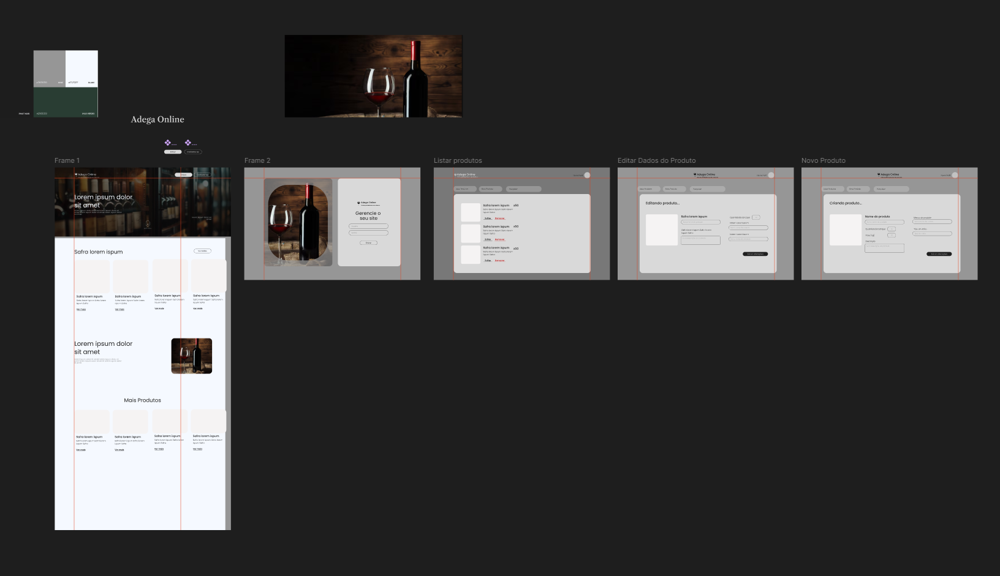

# Wine Project - Adega online

Estive desenvolvendo um protótipo das telas

#Protótipo:

#Pode ser acessado pelo link abaixo:

[Design no Figma](https://www.figma.com/design/vl2tpOvSsI6cSswJjI6vhP/Untitled?node-id=4-7&t=3nYfbWqGirNS3frq-1)

#Mapeando as tabelas do banco de dados

#Para executar o projeto

# npm install

# Instale o Apollo Client 
# npm install @apollo/client @vue/apollo-composable graphql

#npm run dev

#Tem duas rotas configuradas, rota '/' que seria a landing page, uma página inicial contendo uma apresentação sobre o negócio e recursos em destaque como coleção de produtos, sobre a empresa, categorias.

#Temos a rota /listar-produtos, onde terá a listagem dos produto onde o usuário iria editar, adicionar ou remover.

#A ideia inicial era realizar uma autenticação basica para acessar esse painel com um login de amin, e deixar a landing page para o usuário selecionar itens em um carrinho e posteriomente finalizar a compra;

 
