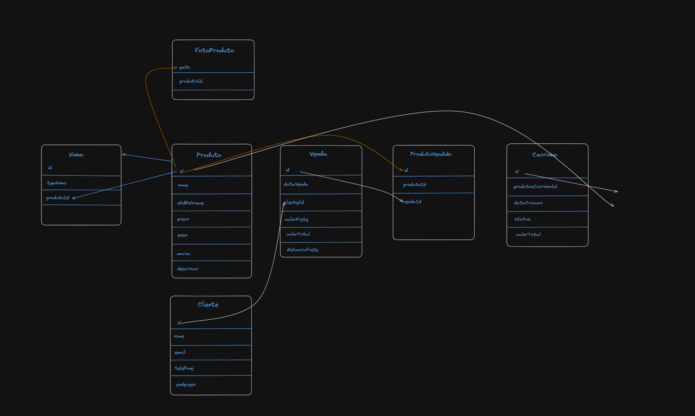

# Wine Project - Adega online

Estive desenvolvendo um protótipo das telas

#Protótipo:

#Pode ser acessado pelo link abaixo:

[Design no Figma](https://www.figma.com/design/vl2tpOvSsI6cSswJjI6vhP/Untitled?node-id=4-7&t=3nYfbWqGirNS3frq-1)

#Mapeando as tabelas do banco de dados

# Para executar o projeto frontend:

Instalar o npm:
➡️ npm install

Executar o comando
➡️ npm run dev

# Para executar o projeto backend:

* Verifique a appSettings e forneça os parametros de conexão Ex:  "DefaultConnection": "Host=host.docker.internal;Port=5432;Database=wineproj3;Username=root;Password=wineproject404"

* Crie a migration:
1. Clique com o botão direito na camada 02-WineProject.Data > Abrir no terminal | Ficará como: seu-diretorio\wine-project\backend\02-WineProject.Data>

2. Execute o comand:  dotnet ef migrations add AtualizarProdutos --project . --startup-project ..\WineProject.API\ ( caso não tenha migrations )

3. Excute o comando: dotnet ef database update --project . --startup-project ..\WineProject.API\ 

> [!NOTE]
>Tem duas rotas configuradas, rota '/' para  landing page, uma página inicial contendo uma apresentação sobre o negócio e recursos em destaque como coleção de produtos, sobre a empresa, categorias.

> Temos a rota /listar-produtos, onde terá a listagem dos produto onde o usuário iria editar, adicionar ou remover.

>A ideia inicial era realizar uma autenticação basica para acessar esse painel com um login de amin, e deixar a landing page para o usuário selecionar itens em um carrinho e posteriomente finalizar a compra;

 
